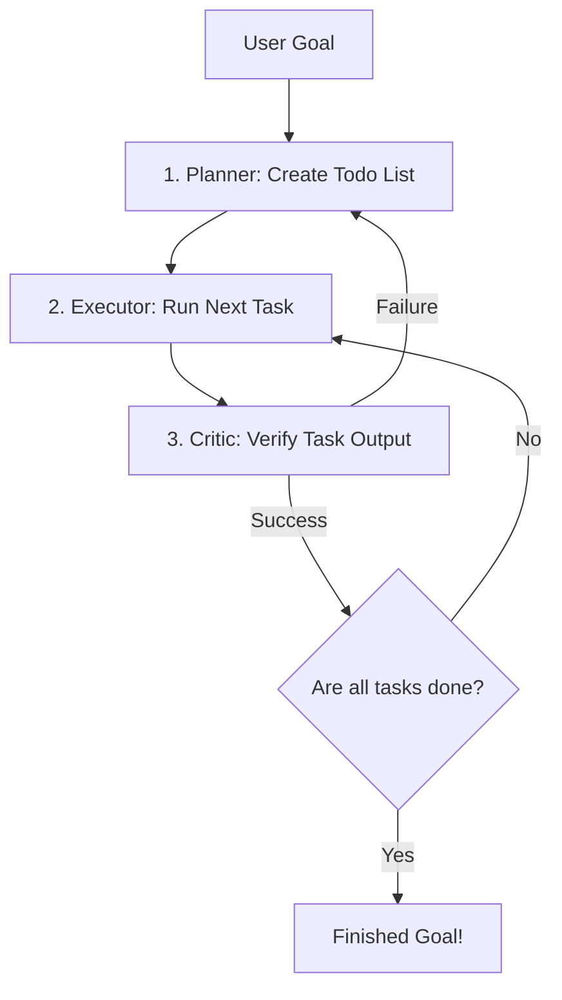

# AI Agent Loop for AI Harness

This document explains how to design the core **Agent Loop** for your AI Harness (Phase 5 of your roadmap). It includes a TypeScript template demonstrating a Planner-Executor-Critic loop and explains how to make your terminal header resize automatically.

---

## 1. The Agent Loop Concept

An agent loop is a recursive process where the AI takes a high-level goal, breaks it down into a list of tasks, and iteratively executes them, checking for success/failure at each step.



---

## 2. Sample Agent Loop Code

Here is a simple, type-safe implementation template in TypeScript. You can place this in a new file (e.g., `src/agent/loop.ts`):

```typescript
import axios from "axios";

// 1. Core Interfaces
interface Task {
  id: string;
  description: string;
  status: "todo" | "in-progress" | "done" | "failed";
  result?: string;
}

interface AgentState {
  goal: string;
  todoList: Task[];
  currentTaskId: string | null;
  history: { role: string; text: string }[];
}

export class Agent {
  private state: AgentState;
  private apiKey: string;

  constructor(goal: string, apiKey: string) {
    this.state = {
      goal,
      todoList: [],
      currentTaskId: null,
      history: []
    };
    this.apiKey = apiKey;
  }

  // 2. Query Gemini API
  private async queryLLM(prompt: string): Promise<string> {
    const response = await axios.post(
      `https://generativelanguage.googleapis.com/v1beta/models/gemini-1.5-flash:generateContent?key=${this.apiKey}`,
      {
        contents: [
          ...this.state.history.map(h => ({ role: h.role, parts: [{ text: h.text }] })),
          { role: "user", parts: [{ text: prompt }] }
        ]
      }
    );
    const resultText = response.data.candidates?.[0]?.content?.parts?.[0]?.text ?? "";
    return resultText;
  }

  // 3. Step 1: Create Plan (Planner)
  async createPlan(): Promise<void> {
    console.log("Planning tasks for goal:", this.state.goal);
    
    const prompt = `
      You are an agent. Break down the user's goal into a list of tasks.
      Return the tasks as a JSON array where each item is a string.
      Goal: "${this.state.goal}"
      Format example: ["Write test file", "Run tests", "Fix bugs"]
    `;

    const response = await this.queryLLM(prompt);
    
    // Parse the JSON array from response
    try {
      const jsonStart = response.indexOf("[");
      const jsonEnd = response.lastIndexOf("]") + 1;
      const taskStrings: string[] = JSON.parse(response.slice(jsonStart, jsonEnd));
      
      this.state.todoList = taskStrings.map((desc, idx) => ({
        id: `task-${idx + 1}`,
        description: desc,
        status: "todo"
      }));
    } catch (e) {
      // Fallback fallback if JSON parsing fails
      this.state.todoList = [{ id: "task-1", description: "Execute goal directly", status: "todo" }];
    }
  }

  // 4. Step 2: Execute Task (Executor)
  async executeTask(task: Task): Promise<string> {
    console.log(`Executing: ${task.description}`);
    task.status = "in-progress";

    const prompt = `
      You are executing task: "${task.description}" 
      under the overall goal: "${this.state.goal}".
      Perform the task and describe the actions/outputs.
    `;
    
    const output = await this.queryLLM(prompt);
    task.status = "done";
    task.result = output;
    return output;
  }

  // 5. Step 3: Critic Task (Critic)
  async criticizeTask(task: Task): Promise<boolean> {
    console.log(`Criticizing output for: ${task.description}`);
    
    const prompt = `
      Review the result of the task: "${task.description}".
      Result output: "${task.result}".
      Has this task succeeded? Return ONLY 'YES' or 'NO'.
    `;

    const answer = await this.queryLLM(prompt);
    if (answer.trim().toUpperCase().includes("YES")) {
      return true;
    } else {
      task.status = "failed";
      return false;
    }
  }

  // 6. The Core Loop Execution
  async start() {
    await this.createPlan();

    for (const task of this.state.todoList) {
      let attempts = 0;
      let succeeded = false;

      while (attempts < 3 && !succeeded) {
        attempts++;
        const output = await this.executeTask(task);
        succeeded = await this.criticizeTask(task);

        if (!succeeded) {
          console.log(`Task failed. Attempt ${attempts}/3. Re-trying...`);
        }
      }

      if (!succeeded) {
        console.log("Stopping loop. Task failed permanently.");
        break;
      }
    }

    console.log("Goal execution complete!");
  }
}
```

---

## 3. Resolving the Header Resize Bug

### Why the Header Doesn't Resize
Currently, standard terminal resize events are captured by `process.stdout.on("resize")` inside `Screen`. However, the header is generated by:
```typescript
main.header("WELCOME TO AI CLI");
```
This prints the header **once** and stores the rendered string in `this.buffer[0]`. 
When you resize the window, `buffer[0]` remains the old, static string rendered at the previous width. It is never recalculated.

### The Solution: Keep Header State & Re-render on Resize

To fix this, you need to store the current header text as state inside `Terminal` so that when a resize event happens, the `Terminal` class can automatically call `header()` with the new screen width.

#### Update your [terminal.ts](file:///home/alterwill/Github/100xDevs/terminalAiChat/src/terminal.ts):

1. **Add a state variable** to the `Terminal` class to track the current header text:
   ```typescript
   export default class Terminal {
     // ... properties ...
     headerText: string = ""; 
   ```

2. **Update the `header()` method** to save this state:
   ```typescript
   header(a: string): void {
     this.headerText = a; // Save current text
     const headerBox = new Box(a, "center");
     headerBox.addDimeansions(this.screen.width, 3);
     headerBox.setBorder("heavy");
     this.buffer[0] = headerBox.render().join("\n");
   }
   ```

3. **Listen for resize events** inside the `Terminal` constructor, clearing the screen and re-rendering both header and input components using the updated width:
   ```typescript
   constructor() {
     // ... initialization ...
     
     // Detect window resize
     process.stdout.on("resize", () => {
       console.clear();
       this.header(this.headerText); // Rebuilds header with new width
       this.inputBox();              // Rebuilds input box with new width
       this.display();               // Prints updated buffer and sets cursor
     });
   }
   ```
