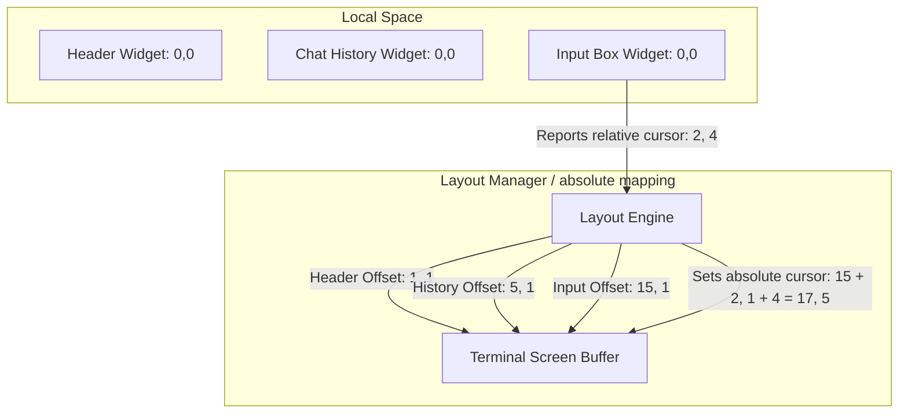

# Offset-Based Layout System & Layout Managers for Terminal UIs

This document explains the architecture of an **Offset-Based Layout System** and **Layout Managers** for terminal-based text user interfaces (TUIs). It discusses how to decouple rendering, layout, and cursor tracking without resorting to complex global variables, and how to implement advanced layouts like Flexbox.

---

## 1. The Core Architecture

In a naive TUI, a single central renderer prints strings sequentially. This becomes problematic when:
1. **Dynamic text wrapping** changes the height of one section, shifting all sections below it.
2. **Cursor tracking** requires parsing text layouts manually in different places.
3. **Resizing the window** forces you to recalculate coordinates manually for every component.

An **Offset-Based Layout System** solves this by separating the screen into **local coordinate spaces** and **absolute coordinate spaces**.



---

## 2. Drawing and Compositing

Each Widget (e.g., `Box`, `InputBox`, `List`) only knows about its own local boundaries:
* It renders into a local array of strings `string[]` starting at relative row `0`.
* It does not know or care where it resides on the screen.

The **Layout Manager** keeps track of where each widget is placed:
```typescript
interface PlacedWidget {
  widget: Box;
  row: number; // Absolute terminal row (y)
  col: number; // Absolute terminal col (x)
}
```

When rendering a frame, the Layout Manager iterates through all placed widgets and writes their local lines into a shared screen buffer at their target absolute positions before rendering the buffer to `stdout`.

---

## 3. Decoupled Cursor Management

The most annoying part of terminal input is placing the terminal cursor at the end of the text in an input box.

Instead of having your `Terminal` class split the input string by length, the focused widget implements a `getCursorOffset()` method that returns where its cursor is relative to its own `(0,0)` origin.

### Example: How `Box` calculates relative cursor position:
```typescript
getCursorOffset(): { x: number; y: number } {
  const splitWidth = this.width - (2 * this.Xpadding) - (2 * this.borderCharacters.vertical.length);
  const lines = splitByLength(this.text, splitWidth);
  const lastLine = lines[lines.length - 1] ?? "";
  
  return {
    x: this.borderCharacters.vertical.length + this.Xpadding + lastLine.length + 1,
    y: Math.max(lines.length, 1) // 1-indexed line offset
  };
}
```

### How the Screen places the cursor absolutely:
The screen simply finds the active widget, gets its absolute top-left coordinate, and adds the offset:

$$\text{Absolute Cursor Y} = \text{widget.absoluteRow} + \text{widget.getCursorOffset().y} - 1$$
$$\text{Absolute Cursor X} = \text{widget.absoluteCol} + \text{widget.getCursorOffset().x} - 1$$

---

## 4. Avoiding the 2D Canvas: Sequential Vertical Compositing

Implementing a full 2D grid/canvas buffer in a terminal can be difficult because of wide Unicode characters (emojis), ANSI escape sequences, and console encoding bugs. 

If you are only stacking components **vertically** (e.g., Header on top, Chat History in the middle, Input Box on the bottom), you **do not need a 2D canvas**. You can render everything using **Sequential String Joins**:

```typescript
class VerticalLayout {
  private widgets: Box[] = [];

  render(): string {
    // 1. Render each widget locally to string[]
    // 2. Flat map/concatenate all lines vertically
    const allLines: string[] = [];
    for (const widget of this.widgets) {
      allLines.push(...widget.render());
      allLines.push(""); // Optional empty line spacer between widgets
    }
    
    // 3. Join with newline and print in a single stdout call
    return allLines.join("\n");
  }
}
```

---

## 5. Designing a Recursive Widget Tree (Flex & Layouts)

To make your layout recursive (where a layout has widgets, and those widgets can contain other layouts), you should use the **Composite Design Pattern**:

### 1. The Core `Widget` Interface
Define a simple base contract that both leaf widgets (like `TextBox`) and container widgets (like `FlexContainer`) must implement:

```typescript
interface Widget {
  width: number;
  height: number;
  
  addDimensions(width: number, height: number): void;
  render(): string[];
}
```

### 2. The Container Widget
A container implements `Widget` but holds a collection of children and layouts them recursively:

```typescript
class FlexContainer implements Widget {
  width: number = 0;
  height: number = 0;
  private children: Widget[] = [];
  private direction: "vertical" | "horizontal" = "vertical";

  addDimensions(width: number, height: number) {
    this.width = width;
    this.height = height;
    
    // Recursive distribution: Pass constraints down to children
    const childHeight = Math.floor(height / this.children.length);
    for (const child of this.children) {
      child.addDimensions(width, childHeight);
    }
  }

  render(): string[] {
    const lines: string[] = [];
    if (this.direction === "vertical") {
      for (const child of this.children) {
        lines.push(...child.render());
      }
    } else {
      // Horizontal side-by-side rendering (joining columns line-by-line)
      const childrenLines = this.children.map(c => c.render());
      const maxRows = Math.max(...childrenLines.map(cl => cl.length));
      
      for (let r = 0; r < maxRows; r++) {
        let combinedRow = "";
        for (let c = 0; c < this.children.length; c++) {
          const colLines = childrenLines[c] ?? [];
          const line = colLines[r] ?? " ".repeat(this.children[c]!.width);
          combinedRow += line;
        }
        lines.push(combinedRow);
      }
    }
    return lines;
  }
}
```

---

## 6. How to Handle Borders, Padding, and Margins

If you want widgets to have optional borders and padding, how should you implement it?

### Approach A: The Configurable Base Widget (Easiest & Cleanest)
Instead of subclassing or extending for different border types, make the **Border** a optional configuration in your base widget class.

If no border is configured, the widget simply renders its content raw.

#### Note: Your current `Box` class already supports no borders!
You don't need to change any code to render a `Box` with no borders. Simply set the border characters to empty strings `""`:

```typescript
const borderlessBox = new Box("Text goes here", "left");
borderlessBox.setBorderCharacters("", "", "", "", "", ""); // No borders
borderlessBox.addPadding(0, 0); // No padding
```
Because `vertical.length` is `0`, the text width calculations inside `Box.render()` will automatically adjust:
$$\text{textWidth} = \text{width} - 2\times\text{vertical.length} = \text{width} - 0 = \text{width}$$

---

### Approach B: The Decorator Pattern (Highly Modular)
If you want to keep leaf widgets extremely small, you can make the `Border` itself a wrapper widget that wraps a child widget:

```typescript
class BorderDecorator implements Widget {
  width: number = 0;
  height: number = 0;
  private child: Widget;
  private style: borderStyle;

  constructor(child: Widget, style: borderStyle) {
    this.child = child;
    this.style = style;
  }

  addDimensions(width: number, height: number) {
    this.width = width;
    this.height = height;
    
    // Subtract border sizes before passing dimensions to child
    this.child.addDimensions(width - 2, height - 2);
  }

  render(): string[] {
    const childLines = this.child.render();
    const result: string[] = [];
    
    // Draw top border line
    result.push(this.style.topLeft + this.style.horizontal.repeat(this.width - 2) + this.style.topRight);
    
    // Draw content with vertical side borders
    childLines.forEach(line => {
      result.push(this.style.vertical + line + this.style.vertical);
    });
    
    // Draw bottom border line
    result.push(this.style.bottomLeft + this.style.horizontal.repeat(this.width - 2) + this.style.bottomRight);
    
    return result;
  }
}
```

---

## 7. Dynamic Render-on-Demand (Clean Code Reuse)

Instead of caching rendered strings in a stateful buffer array (`this.buffer`), you can write a cleaner, **Render-on-Demand** architecture. 

By calculating dimensions and rendering directly inside the `display()` function, you avoid caching static strings. When the window resizes, the components automatically adapt to the updated terminal columns.

### Code Paradigm:
Here is how you can simplify your `Terminal` class using this approach:

```typescript
export default class Terminal {
  screen: Screen;
  headerText: string = "WELCOME TO AI CLI";
  historyText: string = "";
  inputBoxText: string = "";
  
  // padding / margin configurations...

  constructor() {
    this.screen = new Screen();

    // Resize event simply clears the console and triggers a fresh draw
    process.stdout.on("resize", () => {
      console.clear();
      this.display(); 
    });
  }

  display(): void {
    let cursorY = 1;
    let cursorX = 1;

    // 1. Render & Print Header Box (Dynamic width)
    const headerBox = new Box(this.headerText, "center");
    headerBox.addDimeansions(this.screen.width, 3);
    headerBox.setBorder("heavy");
    console.log(headerBox.render().join("\n"));
    cursorY += 3 + 1; // 3 lines of header + 1 spacing line

    // 2. Print Chat History
    console.log(this.historyText);
    const historyTextLines = splitByLength(
      this.historyText,
      this.screen.width - this.inputBoxTextXAxisMargin - this.inputBoxTextXAxisPadding - 2
    );
    cursorY += historyTextLines.length + 1;

    // 3. Render & Print Input Box (Dynamic width/height)
    const inputBox = this.createInputBox();
    const margin = " ".repeat(this.inputBoxTextXAxisMargin);
    console.log(inputBox.render().map(line => margin + line + margin).join("\n"));

    // 4. Update Cursor Position based on active InputBox metrics
    const cursorOffset = inputBox.getCursorOffset();
    cursorY += cursorOffset.y - 1;
    cursorX = this.inputBoxTextXAxisMargin + cursorOffset.x;

    // 5. Render exit message if active
    if (this.displayExitMessageForCtrlC) {
      const exitMsg = "Press Ctrl+C again to exit...";
      cursorY += 2;
      cursorX = exitMsg.length + 1;
      console.log(exitMsg);
    }

    // 6. Move cursor to calculated absolute coordinate
    this.screen.cursorTo(cursorY, cursorX);
  }

  createInputBox(): InputBox {
    const inputLines = splitByLength(this.inputBoxText, this.getInputBoxWidth());
    const boxHeight = Math.max(inputLines.length, 1) + 2;
    const boxWidth = this.screen.width - (2 * this.inputBoxTextXAxisMargin);

    const inputBox = new InputBox(this.inputBoxText, "left");
    inputBox.addDimeansions(boxWidth, boxHeight);
    inputBox.addPadding(this.inputBoxTextXAxisPadding, 0);
    return inputBox;
  }
}
```

### Why this is better:
1. **Deletes `this.buffer`**: You don't have to keep static string arrays synchronized in memory.
2. **Deletes Cache Updating methods**: You no longer need to call separate `this.header(...)` or `this.inputBox(...)` routines when text changes; you just update the string states (`this.headerText = "..."`) and call `.display()`.
3. **Perfect Resizing**: The resize listener is reduced to just a single line: `this.display()`. It naturally picks up the new screen width and height.
